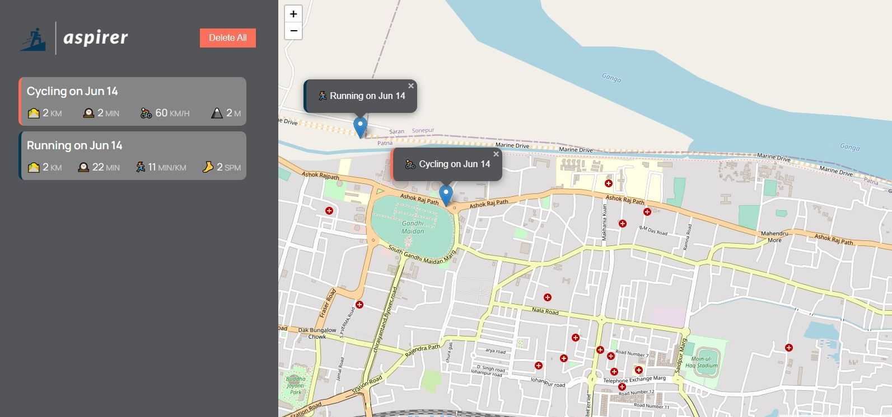

# Aspirer
A small Web Application which is made to help you manage your *running* and *cycling* activities. This is just another version of [mapty](https://mapty.netlify.app/), 
a project made originally by [jonas](https://twitter.com/jonasschmedtman). I though why not making this all by myself from scratch and not just the JavaScript part that
Jonas showed in his [udemyCoarse](https://www.udemy.com/course/the-complete-javascript-course/). So here is my version with some extra features.

## Fully Responsive
Aspirer is *fully responsive* for any screen width!

## Languages, Techniques and Tools Used
- HTML5
- Sass(SCSS syntax)
- Vanilla JavaScript
- Leaflet
- Fluid Typography
- fontAwesome
- Live server
- Live-Sass compiler
- Google Fonts
- Adobe Spark
- Vs Code 

You may visit the site [here](https://roctanweer.github.io/aspirer/)

## User's Can
- Log their *running*/*cycling* activity with date, duration, distance, cadence/elevationGain, pace/speed with **location** on map
- Put a *detailed* marker on the map by clicking on the map where the activity happened 
- Move the map to corresponding marker when clicked on the logged activity
- Delete a logged activity by clicking on the trash can icon along with the corresponding marker on the map
- Delete all the logged activities along with all the markers on the map by clicking on the *Delete ALl* button
- Revisit the application without loosing any of their data

